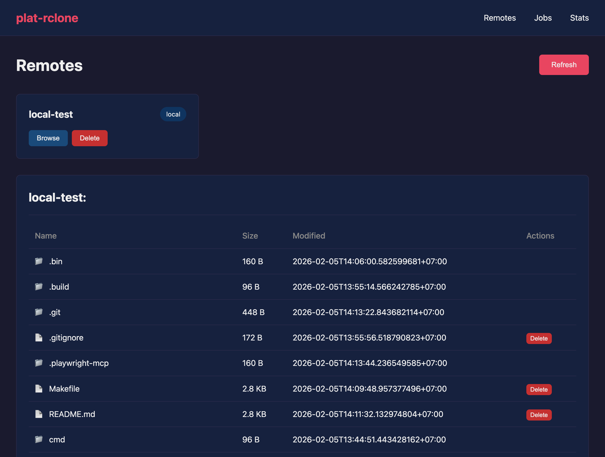
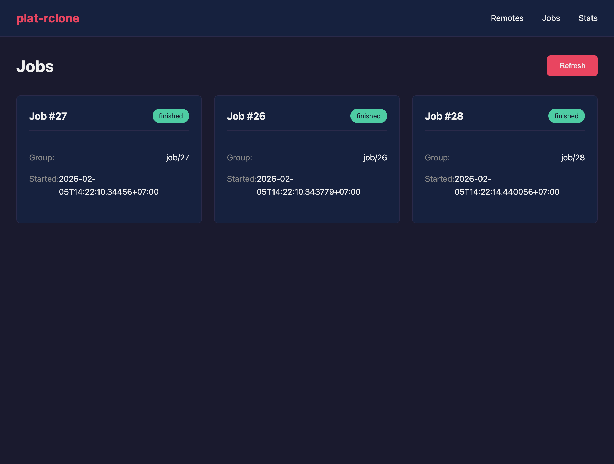
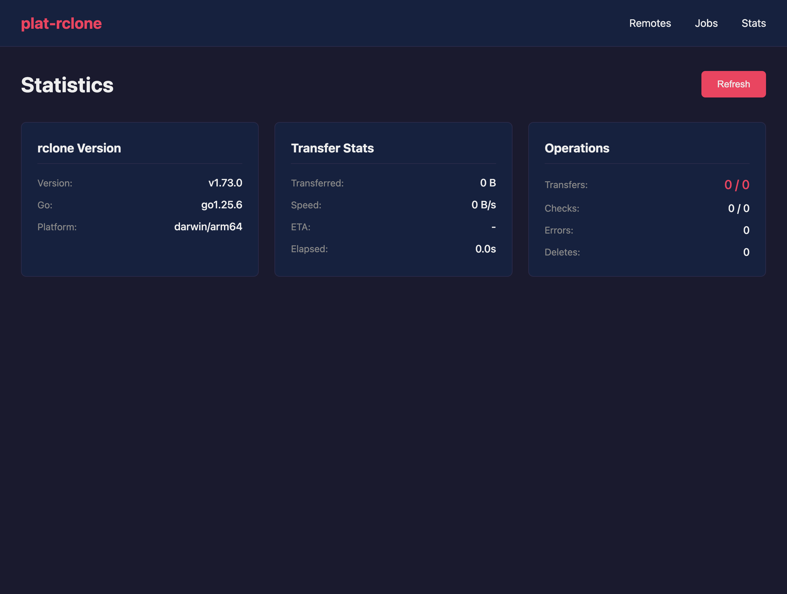
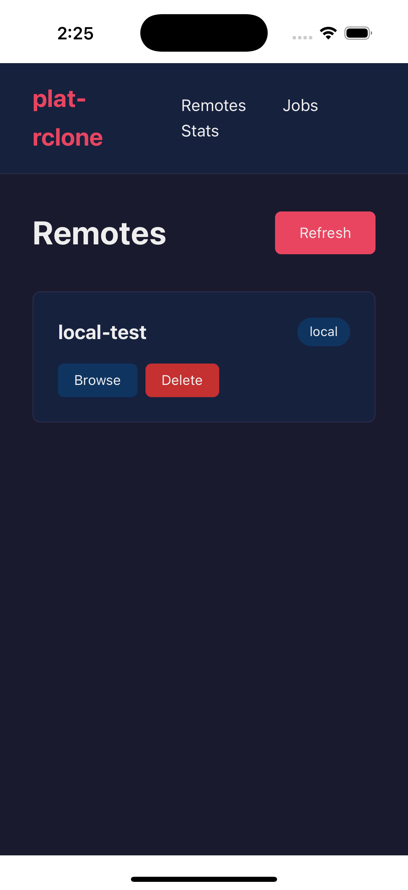

# plat-rclone

Cross-platform GUI for [rclone](https://rclone.org) using Datastar + Gio.

| Remotes | File Browser |
|---------|--------------|
|  |  |

| Jobs | Stats |
|------|-------|
|  |  |

### iOS (iPhone 16 Pro)



## Features

- **Cross-platform** - macOS, iOS, Android, Windows from single codebase
- **Native webview** - Gio + webviewer for native performance
- **Real-time UI** - Datastar SSE for instant updates (~11KB)
- **Web server** - Headless mode for browsers
- **rclone Integration** - Full RC API support

### rclone Features

| Feature | Status |
|---------|--------|
| List remotes | Yes |
| Browse files | Yes |
| View jobs | Yes |
| Live stats | Yes |
| Delete files | Yes |
| Stop jobs | Yes |
| Copy/Move | Planned |
| Create remote | Planned |

## Quick Start

```bash
make download                      # Get rclone binary
./.bin/rclone rcd --rc-no-auth     # Start rclone RC API (other terminal)
make run-macos                     # Run native app
# or
make dev                           # Run web server (http://localhost:8080)
```

## goup-util Integration

This project uses [goup-util](https://github.com/joeblew999/goup-util) for cross-platform builds with zero configuration.

### Build Commands

```bash
make all        # Build all platforms
make macos      # macOS .app bundle     -> .bin/plat-rclone.app
make ios        # iOS .app              -> .bin/plat-rclone.app
make android    # Android .apk          -> .bin/plat-rclone.apk
make windows    # Windows .exe          -> .bin/plat-rclone.exe
```

### goup-util Features Used

| Feature | Command | Description |
|---------|---------|-------------|
| Cross-compilation | `goup-util build <platform> .` | Single command builds for any platform |
| Icon generation | `make icons` | Generate all app icons from `icon-source.png` |
| SDK management | `goup-util sdk` | Download iOS/Android SDKs automatically |
| App bundling | Automatic | Creates proper .app/.apk bundles |

### Platform Requirements

| Platform | Requirements |
|----------|--------------|
| macOS | Xcode Command Line Tools |
| iOS | Xcode with iOS SDK |
| Android | Android NDK (auto-downloaded by goup-util) |
| Windows | MinGW or cross-compiler |

## Run Modes

```bash
# Native app (Gio + WebView)
make run-macos    # Run macOS app
make ios-sim      # Install to iOS simulator

# Web server (headless)
make run-web      # http://localhost:8080
make dev          # Dev mode with hot reload
```

## Architecture

```
plat-rclone/
├── main.go              # Gio + webviewer native app
├── cmd/plat-rclone/     # Web server CLI (headless mode)
├── pkg/
│   ├── datastar/        # SSE helpers for Datastar
│   ├── rclone/          # rclone RC API client
│   └── router/          # Chi router + Datastar integration
├── templates/           # templ HTML templates
│   ├── layout.templ     # Base layout
│   ├── remotes.templ    # Remotes & file browser
│   ├── jobs.templ       # Job monitoring
│   └── stats.templ      # Transfer statistics
├── static/
│   ├── css/style.css    # Dark theme styling
│   └── js/              # Datastar bundles (embedded)
├── icon-source.png      # 1024x1024 app icon source
├── Makefile             # Build automation
├── .bin/                # Build output (gitignored)
└── .build/              # Intermediate files (gitignored)
```

## Datastar Versions

The Go SDK and JS library must be compatible:

| Go SDK (datastar-go) | JS Library | Status |
|---------------------|------------|--------|
| v1.1.0 | v1.0.0-RC.7 | Current |

Update JS library:
```bash
make datastar    # Downloads all bundles to static/js/
```

Available bundles:
- `datastar.js` - Full bundle (30KB)
- `datastar-core.js` - Core only (9KB)
- `datastar-aliased.js` - Aliased exports

## AI Debugging

Since plat-rclone uses standard web technologies, AI tools can debug the UI using browser automation:

```bash
make dev    # Start dev server

# AI can use Playwright MCP to:
# - Take DOM snapshots
# - Click buttons and test interactions
# - Inspect SSE streams
# - Verify Datastar reactivity
```

## Requirements

- Go 1.24+
- [goup-util](https://github.com/joeblew999/goup-util) - Cross-platform build tool
- [templ](https://github.com/a-h/templ) - Type-safe HTML templates

Install tools:
```bash
make tools    # Install templ
# goup-util: see https://github.com/joeblew999/goup-util
```

## References

- [goup-util](https://github.com/joeblew999/goup-util) - Cross-platform Gio build tool
- [rclone RC API](https://rclone.org/rc/) - Remote control API
- [Datastar](https://data-star.dev/) - Hypermedia framework
- [Gio](https://gioui.org/) - Go UI framework
- [templ](https://templ.guide/) - Go HTML templates
