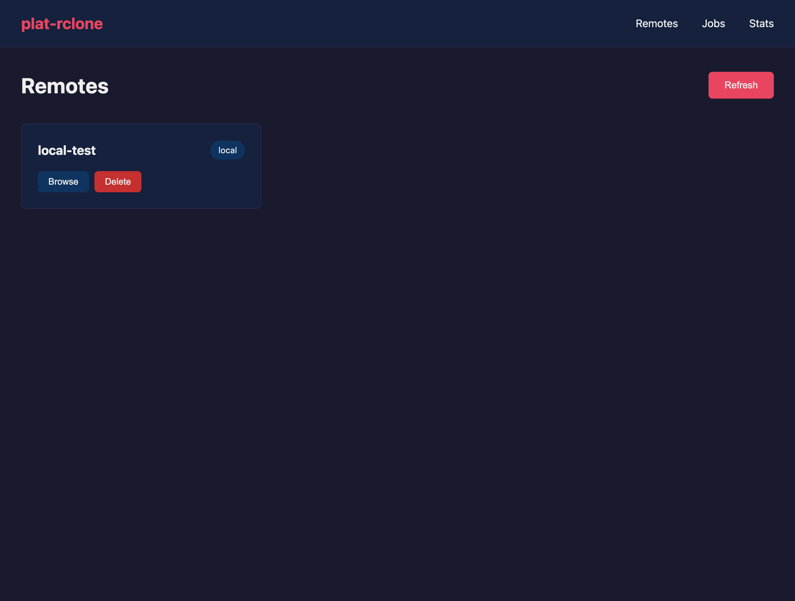
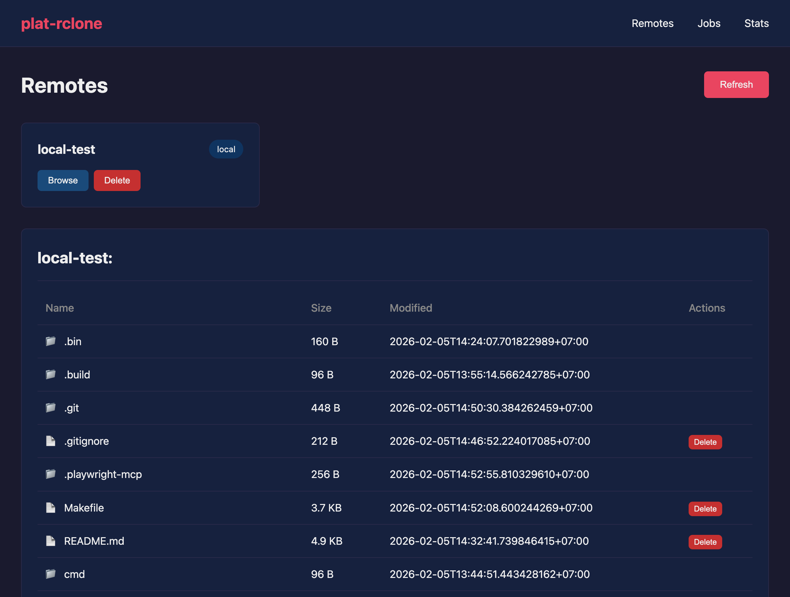
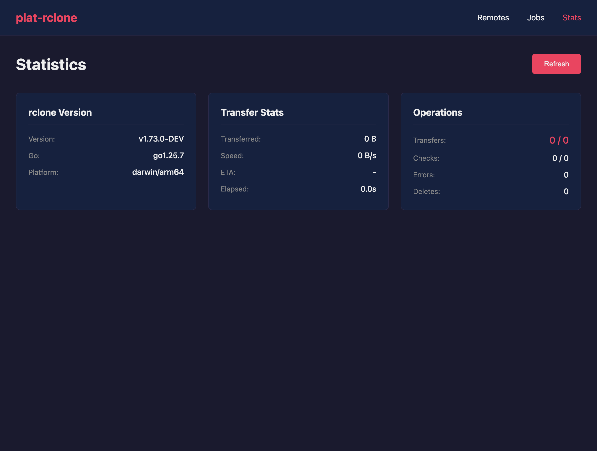

# plat-rclone

Cross-platform GUI for [rclone](https://rclone.org) using Datastar + Gio.

| Remotes | File Browser |
|---------|--------------|
|  |  |

| Stats | iOS |
|-------|-----|
|  |  |

## Features

- **Cross-platform** - macOS, iOS, Android, Windows from single codebase
- **Embedded rclone** - No external daemon needed (via librclone)
- **Native webview** - Gio + webviewer for native performance
- **Real-time UI** - Datastar SSE for instant updates
- **CI/CD** - Full releases via xplat + goup-util

### rclone Integration

| Mode | Description |
|------|-------------|
| **Embedded** | rclone runs in-process via librclone (no daemon) |
| **HTTP** | Connect to external `rclone rcd` daemon |

| Feature | Status |
|---------|--------|
| List remotes | Yes |
| Browse files | Yes |
| View jobs | Yes |
| Live stats | Yes |
| Delete files | Yes |
| Stop jobs | Yes |
| Copy/Move | Planned |

## Quick Start

### Using xplat (recommended)

```bash
# Install xplat
curl -fsSL https://raw.githubusercontent.com/joeblew999/xplat/main/install.sh | sh

# Run with embedded rclone (no daemon needed!)
xplat task dev-embedded

# Open http://localhost:8080
```

### Using Make

```bash
# Embedded mode (no daemon needed)
make dev-embedded

# Or HTTP mode (needs external rclone)
make download                      # Get rclone binary
./.bin/rclone rcd --rc-no-auth     # Start rclone (other terminal)
make dev                           # Run web server
```

## Build Options

### Embedded rclone (librclone)

plat-rclone can embed rclone directly - no external daemon required.

| Build | Command | Binary Size | Backends |
|-------|---------|-------------|----------|
| Light | `make dev-embedded` | ~30MB | Local only |
| Full | `make dev-embedded-full` | ~100MB | All (S3, GDrive, etc.) |

```bash
# Light build (local backend only - good for mobile)
go build ./cmd/plat-rclone

# Full build (all backends)
go build -tags=rclone_full ./cmd/plat-rclone
```

### Native Apps (via goup-util)

```bash
xplat task macos      # macOS .app bundle
xplat task ios        # iOS .app
xplat task android    # Android .apk
xplat task windows    # Windows .exe
xplat task all        # All platforms
```

## CI/CD

Releases are automated via GitHub Actions using [xplat](https://github.com/joeblew999/xplat).

### Why xplat? DRY Build Automation

xplat eliminates duplication between local development and CI:

| Traditional Approach | xplat Approach |
|---------------------|----------------|
| Makefile for local, bash scripts for CI | Single `Taskfile.yml` everywhere |
| Platform-specific commands (`curl`, `uname`) | `xplat os` cross-platform utils |
| Manual tool version tracking | Idempotent installs with checksums |
| Different logic in CI vs local | Same `xplat task` commands |

```yaml
# Taskfile.yml - works identically on macOS, Linux, Windows, and CI
tools:
  status: [xplat os which templ]        # Skip if already installed
  cmds:   [go install ...templ@latest]  # Idempotent
```

```yaml
# CI just calls the same tasks
- run: xplat task setup   # Idempotent - skips if tools exist
- run: xplat task build
- run: xplat task test
```

No shell-specific code, no platform conditionals, no duplicated logic.

### Creating a Release

```bash
git tag v1.0.0
git push origin v1.0.0
# GitHub Actions builds all platforms automatically
```

### Release Artifacts

| Platform | Artifacts |
|----------|-----------|
| macOS | `.app` bundle, web server binary |
| Windows | `.exe` native app, web server binary |
| Linux | Web server binary |
| iOS | `.app` (build locally with Xcode) |
| Android | `.apk` (build locally) |

## Architecture

```
plat-rclone/
├── cmd/plat-rclone/     # CLI (web server + embedded rclone)
├── pkg/
│   ├── rclone/          # rclone client (HTTP + embedded backends)
│   │   ├── backend.go           # Backend interface
│   │   ├── backend_http.go      # HTTP backend (remote rclone)
│   │   ├── backend_embedded.go  # Embedded backend (librclone)
│   │   ├── backend_imports.go   # Local backend only (default)
│   │   └── backend_imports_full.go  # All backends (-tags=rclone_full)
│   ├── datastar/        # SSE helpers
│   └── router/          # Chi router + Datastar
├── templates/           # templ HTML templates
├── static/              # CSS + JS (Datastar)
├── main.go              # Gio native app (webview)
├── Taskfile.yml         # xplat tasks
├── Makefile             # Make targets (alias to tasks)
├── xplat.yaml           # xplat manifest
└── .github/workflows/   # CI/CD
```

## Development

### With xplat

```bash
xplat task dev              # HTTP mode (needs rclone rcd)
xplat task dev-embedded     # Embedded mode (local backend)
xplat task dev-embedded-full # Embedded mode (all backends)
xplat task test             # Run tests
xplat task fmt              # Format code
```

### With Make

```bash
make help                   # Show all targets
make dev-embedded           # Embedded mode
make test                   # Run tests
```

## Requirements

- Go 1.24+
- [xplat](https://github.com/joeblew999/xplat) - Build orchestration

```bash
# Install xplat, then all tools (templ, goup-util) in one command
curl -fsSL https://raw.githubusercontent.com/joeblew999/xplat/main/install.sh | sh
xplat task setup    # Installs templ + goup-util (idempotent)
```

Tools are installed idempotently - running `xplat task setup` multiple times is safe and fast.

## References

- [xplat](https://github.com/joeblew999/xplat) - Cross-platform CI/CD
- [goup-util](https://github.com/joeblew999/goup-util) - Gio build tool
- [rclone](https://rclone.org) / [librclone](https://rclone.org/rc/#using-rclone-as-a-library) - Cloud sync
- [Datastar](https://data-star.dev/) - Hypermedia framework
- [Gio](https://gioui.org/) - Go UI framework
- [templ](https://templ.guide/) - Go HTML templates
